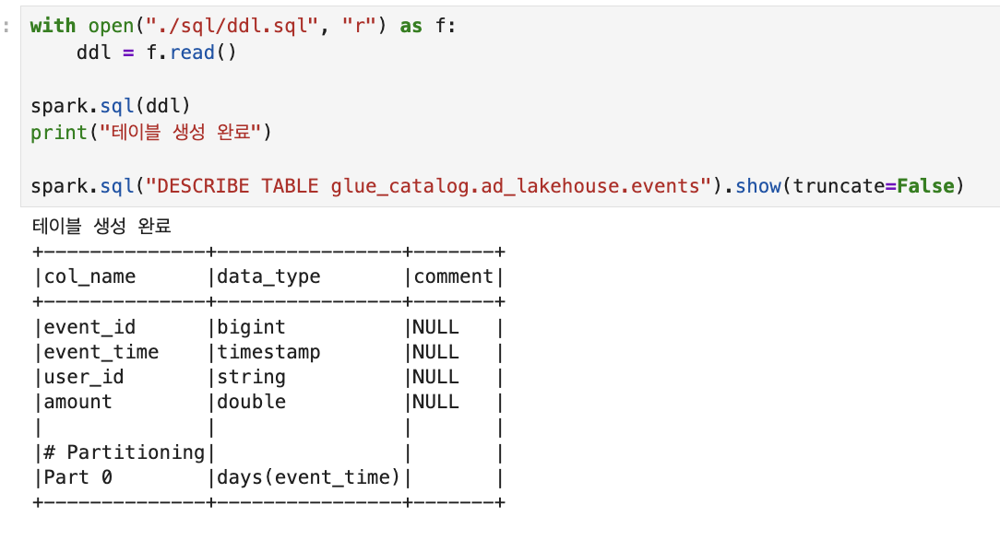
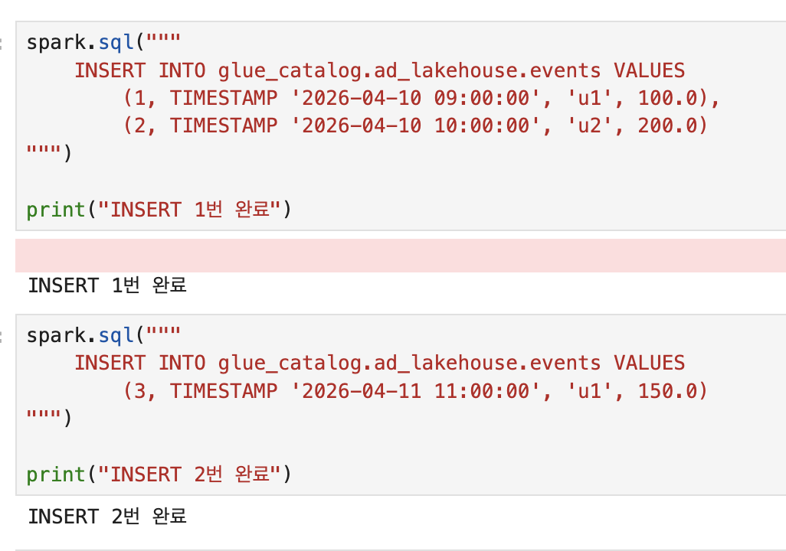
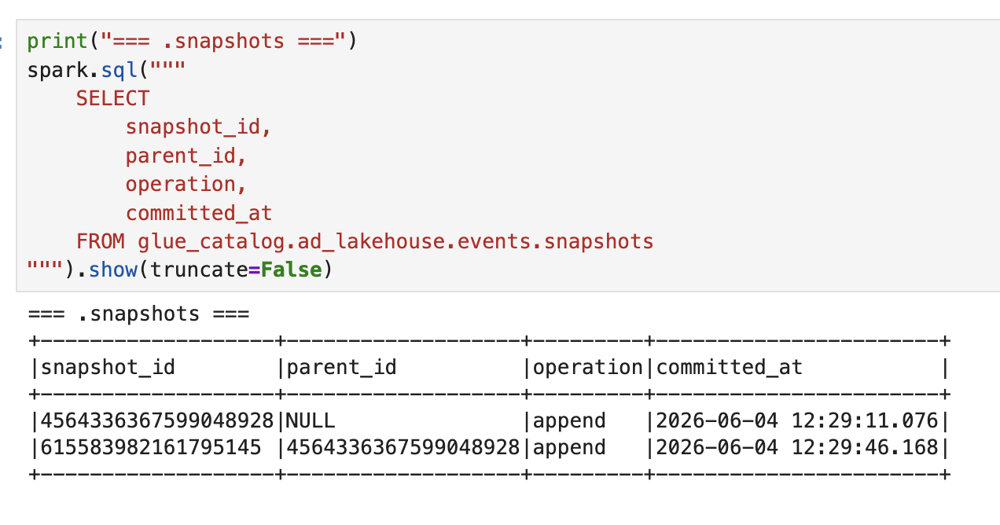
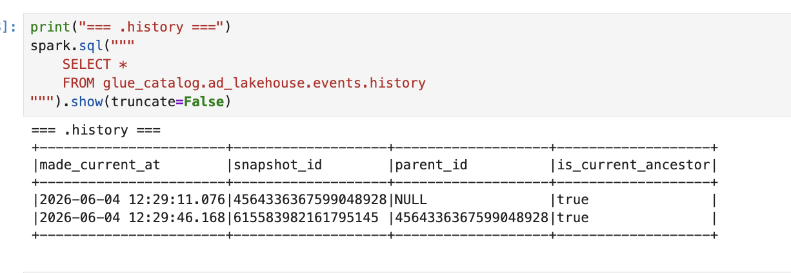
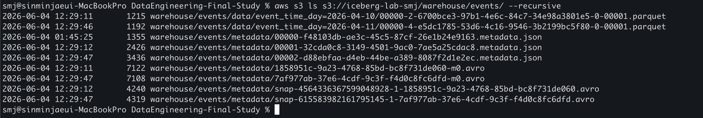
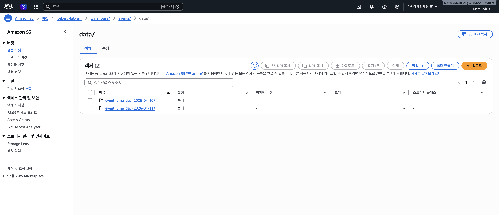
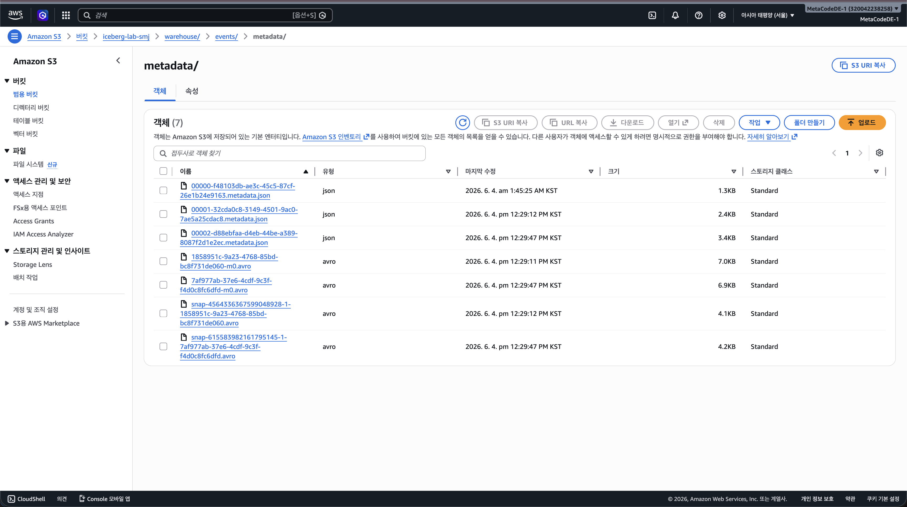

# Session 02 — Lakehouse & Iceberg 핵심 아이디어 실습

## 실습 개요

이번 실습의 목표는 강의에서 이론으로 배운 Iceberg 내부 구조가 실제로 어떻게 생기는지 직접 만들고 눈으로 확인하는 것이다.


## 환경

| 항목 | 값 |
|---|---|
| Python | 3.11.9 (pyenv) |
| PySpark | 3.5.1 |
| Iceberg | 1.5.0 |
| Java | OpenJDK 17 |
| AWS S3 버킷 | `iceberg-lab-smj` |
| AWS Glue Database | `ad_lakehouse` |
| 리전 | `ap-northeast-2` (서울) |

---

## 파일 구조

```
session-02/
  ├── sql/
  │     └── ddl.sql          # iceberg 테이블 정의
  ├── images/                # 각 단계 실행 결과 캡처
  │     ├── 1_glue_table.png
  │     ├── 2_ddl.png
  │     ├── 3_insert.png
  │     ├── 4_snapshots.png
  │     ├── 5_files(file pruning).png
  │     ├── 6_history.png
  │     ├── 7-1_s3_3_layer.png
  │     ├── 7-2_s3_3_layer.png
  │     └── 7-3_s3_3_layer.png
  └── iceberg_lab.ipynb      # 전체 실습 노트북
```

---

## A. DDL + INSERT

### sql/ddl.sql

```sql
CREATE TABLE IF NOT EXISTS glue_catalog.ad_lakehouse.events (
    event_id    BIGINT,
    event_time  TIMESTAMP,
    user_id     STRING,
    amount      DOUBLE
)
USING iceberg
PARTITIONED BY (days(event_time))
LOCATION 's3://iceberg-lab-smj/warehouse/events'
TBLPROPERTIES (
    'format-version' = '2'
);
```

**각 옵션의 의미:**

| 옵션 | 이유 |
|---|---|
| `USING iceberg` | Iceberg 테이블 포맷 선언 |
| `PARTITIONED BY (days(event_time))` | Hidden Partition — event_time에서 날짜 자동 추출 |
| `LOCATION 's3://...'` | 데이터/메타데이터 저장 경로 |
| `format-version = '2'` | MERGE, row-level delete 지원 |

### Hidden Partition이란

기존 Hive 방식은 파티션 컬럼을 테이블에 직접 추가하고, INSERT 시 파티션 값을 직접 명시해야 했다.
Iceberg의 Hidden Partition은 `event_time` 컬럼에서 날짜를 자동 추출해서 파티션을 관리한다.
사용자는 파티션 구조를 신경 쓰지 않고 `event_time`으로만 쿼리하면 된다.

### INSERT 2번 실행

```python
# INSERT 1번 — 2026-04-10 데이터 2행
spark.sql("""
    INSERT INTO glue_catalog.ad_lakehouse.events VALUES
        (1, TIMESTAMP '2026-04-10 09:00:00', 'u1', 100.0),
        (2, TIMESTAMP '2026-04-10 10:00:00', 'u2', 200.0)
""")

# INSERT 2번 — 2026-04-11 데이터 1행
spark.sql("""
    INSERT INTO glue_catalog.ad_lakehouse.events VALUES
        (3, TIMESTAMP '2026-04-11 11:00:00', 'u1', 150.0)
""")
```




---

## B. 메타 테이블 쿼리

### .snapshots

```python
spark.sql("""
    SELECT snapshot_id, parent_id, operation, committed_at
    FROM glue_catalog.ad_lakehouse.events.snapshots
""").show(truncate=False)
```

```
+-------------------+-------------------+---------+-----------------------+
|snapshot_id        |parent_id          |operation|committed_at           |
+-------------------+-------------------+---------+-----------------------+
|4564336367599048928|NULL               |append   |2026-06-04 12:29:11.076|
|615583982161795145 |4564336367599048928|append   |2026-06-04 12:29:46.168|
+-------------------+-------------------+---------+-----------------------+
```

**해석:**
- INSERT 2번 -> 스냅샷 2개 생성
- 첫 번째 `parent_id = NULL` -> 최초 커밋
- 두 번째 `parent_id` -> 첫 번째 스냅샷을 가리킴



---

### .files (File Pruning 통계)

```python
spark.sql("""
    SELECT file_path, record_count, lower_bounds, upper_bounds
    FROM glue_catalog.ad_lakehouse.events.files
""").show(truncate=False)
```

**디코딩 결과:**

| 항목 | 파일 1 (2026-04-11) | 파일 2 (2026-04-10) |
|---|---|---|
| 행 수 | 1 | 2 |
| event_id MIN/MAX | 3 / 3 | 1 / 2 |
| event_time MIN | 2026-04-11 11:00:00 | 2026-04-10 09:00:00 |
| event_time MAX | 2026-04-11 11:00:00 | 2026-04-10 10:00:00 |
| amount MIN/MAX | 150.0 / 150.0 | 100.0 / 200.0 |

**File Pruning 동작 예시:**
`WHERE amount > 180` 쿼리 시 -> 파일 1 (max=150.0) 스킵 ✓ -> 파일 2만 읽음

> lower_bounds / upper_bounds는 Iceberg 내부에서 바이너리로 직렬화되어 저장된다.
> 쿼리 엔진이 이 값을 읽고 파일 스킵 여부를 결정하는 것이 File Pruning의 실체다.

.png)

---

### .history

```python
spark.sql("""
    SELECT *
    FROM glue_catalog.ad_lakehouse.events.history
""").show(truncate=False)
```

```
+-----------------------+-------------------+-------------------+-------------------+
|made_current_at        |snapshot_id        |parent_id          |is_current_ancestor|
+-----------------------+-------------------+-------------------+-------------------+
|2026-06-04 12:29:11.076|4564336367599048928|NULL               |true               |
|2026-06-04 12:29:46.168|615583982161795145 |4564336367599048928|true               |
+-----------------------+-------------------+-------------------+-------------------+
```

**해석:**
- `is_current_ancestor = true` -> 두 스냅샷 모두 현재 상태의 조상
- 롤백 시 이 값이 변경됨
    - 아래 사진에서 `snapshot_id = 4564336367599048928`로 롤백된다면, 두번째 snapshot의 is_current_ancestor가 false가 된다는 뜻.



---

## C. S3 파일 구조 확인

```bash
aws s3 ls s3://iceberg-lab-smj/warehouse/events/ --recursive
```

```
2026-06-04 12:29:11  warehouse/events/data/event_time_day=2026-04-10/00000-2-...parquet
2026-06-04 12:29:46  warehouse/events/data/event_time_day=2026-04-11/00000-4-...parquet
2026-06-04 01:45:25  warehouse/events/metadata/00000-f48103db-...metadata.json
2026-06-04 12:29:12  warehouse/events/metadata/00001-32cda0c8-...metadata.json
2026-06-04 12:29:47  warehouse/events/metadata/00002-d88ebfaa-...metadata.json
2026-06-04 12:29:11  warehouse/events/metadata/1858951c-...-m0.avro
2026-06-04 12:29:47  warehouse/events/metadata/7af977ab-...-m0.avro
2026-06-04 12:29:12  warehouse/events/metadata/snap-4564336367599048928-1-...avro
2026-06-04 12:29:47  warehouse/events/metadata/snap-615583982161795145-1-...avro
```

### 4계층 매핑

| Part 3 이론 | 실제 S3 파일 | 생성 시점 |
|---|---|---|
| Metadata File (JSON) | `metadata/*.metadata.json` | 테이블 생성 + INSERT마다 |
| Manifest List (Avro) | `metadata/snap-*.avro` | INSERT마다 |
| Manifest File (Avro) | `metadata/*-m0.avro` | INSERT마다 |
| Data File (Parquet) | `data/event_time_day=.../*.parquet` | INSERT마다 |

**핵심 관찰:**
- `metadata.json`이 3개 -> 테이블 생성 + INSERT 2번 = 변경 3회
- 기존 파일은 절대 수정하지 않음 -> 항상 새 파일 추가
- `data/` 폴더가 날짜별로 분리 -> Hidden Partition 동작 결과





DDL 옵션중 `LOCATION 's3://iceberg-lab-smj/warehouse/events'` 으로 인해서 iceberg가 이 경로를 기준으로 자동으로 두 폴더를 나눠서 관리함. (S3 구조)

```
s3://iceberg-lab-smj/warehouse/events/
  ├── metadata/   <- 메타데이터 파일 (JSON, Avro)
  └── data/       <- 실제 데이터 파일 (Parquet)
```

위 구조 덕분에 쿼리 엔진이 메타데이터를 읽을 땐 metadata/만 접근하면 되고, 데이터를 읽을 때는 data/만 접근하면 됨. 
즉, 불필요한 파일을 스캔하지 않아도 되는것.


---

## D. metadata.json 분석

최신 버전(두번째 insert 후 생성된) `00002-d88ebfaa-...metadata.json`을 S3 콘솔에서 직접 열어 확인했다.

### current-snapshot-id

```json
"current-snapshot-id" : 615583982161795145
```

Snapshot은 별도 파일이 아니라 **metadata.json 안의 포인터**다.
이 숫자 하나가 현재 테이블 상태를 가리킨다.

### 스냅샷 체인

```json
스냅샷 1: "snapshot-id": 4564336367599048928  // parent 없음 (최초)
스냅샷 2: "snapshot-id": 615583982161795145
          "parent-snapshot-id": 4564336367599048928  // 스냅샷 1을 가리킴
```

### Manifest List 경로

```json
"manifest-list": "s3://.../snap-4564336367599048928-1-...avro"
"manifest-list": "s3://.../snap-615583982161795145-1-...avro"
```

metadata.json -> Manifest List -> Manifest File -> Data File 순서로 경로를 따라가는 구조가 실물로 확인된다.

### metadata-log

```json
"metadata-log": [
  "00000-...metadata.json",  // 테이블 생성
  "00001-...metadata.json"   // INSERT 1번
]
```

현재 파일(`00002`)은 로그에 포함되지 않는다. 자기 자신은 기록하지 않는 구조다.

---